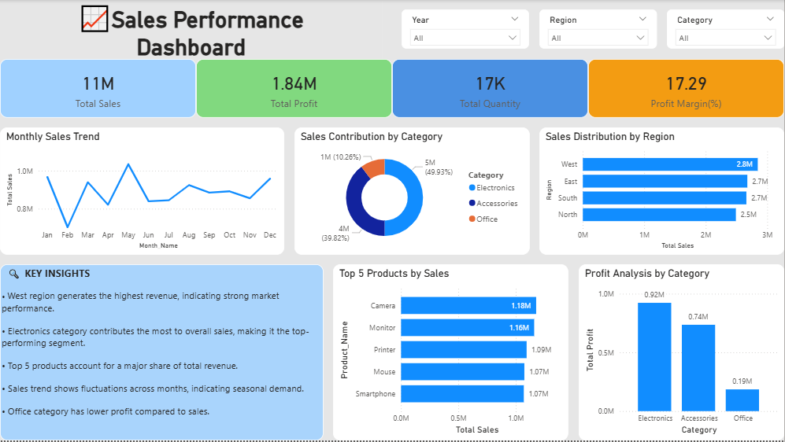

# 🛒 E-commerce Sales Performance Analysis

## 📌 Overview
This project analyzes e-commerce sales data to understand revenue trends, regional performance, and product category contributions. The dashboard provides insights into sales, profit, and customer purchasing patterns.

## 🛠 Tools Used
- Excel
- Python
- SQL
- Power BI

## 📊 Key Metrics
- Total Sales: 11M  
- Total Profit: 1.84M  
- Total Quantity Sold: 17K  
- Profit Margin: 17.29%  

## 📈 Key Insights
- West region generates the highest sales revenue, indicating strong market performance  
- Electronics category contributes the most to overall sales  
- Top 5 products (Camera, Monitor, Printer, Mouse, Smartphone) drive a major share of revenue  
- Sales show fluctuations across months, indicating seasonal trends  
- Office category has lower profit compared to other categories  

## 📂 Files Included
- dataset.csv → E-commerce sales dataset  
- dashboard.pbix → Power BI dashboard  

## 📸 Dashboard Preview

## 🎯 Conclusion
The analysis highlights that regional performance and product categories significantly impact overall sales and profit. Businesses can focus on high-performing regions and products to maximize revenue.

## 📄 Resume
[Download Resume]()# Ecommerce-sales-analysis
